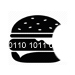

# Lunch Bytes </img>

Lunch Bytes are a computing seminar series that aim to provide an informal forum for RSMAS students, 
researchers, and faculty to discuss and exchange knowledge on various computing topics, tools, and programming languages.

## Where and when:

MSC 343, every Friday, 12 pm.

## Schedule

* **February 15**: TBD
* **February 22**: TBD
* **March 8**: TBD
* **March 15**: Tiago Bilo -- Parallel computing with Python and MPI
* **March 22**: TBD
* **March 29**: TBD
* **April 5**: TBD
* **April 19**: TBD
* **April 26**: TBD

## Presenter Guidelines

* Any format welcome! Slides, live coding, whiteboard, or just your voice.
* 45 minutes or shorter.
* Feel free to ask us for feedback!

## Contributing

Please create a folder for your seminar as LBXX and upload any contents (e.g. slides (pdf's can be read on GitHub), codes, environmental files as well as a README file).

## See also

[Live coding guide by Software Carpentry](http://swcarpentry.github.io/swc-releases/2017.02/instructor-training/13-live/)

## Past seminars

* [Fall 2015](Fall_2015)
* [Spring 2016](Spring_2016)
* [Fall 2018](Fall_2018)
